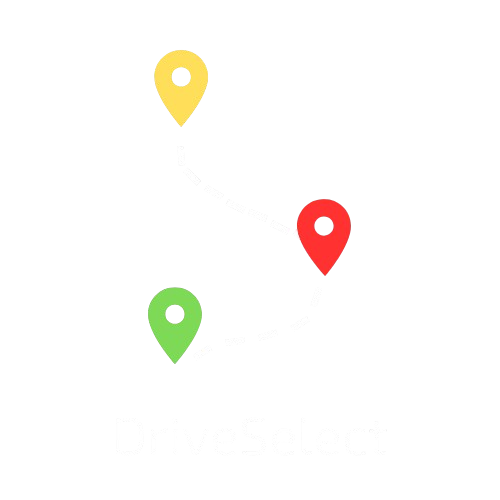
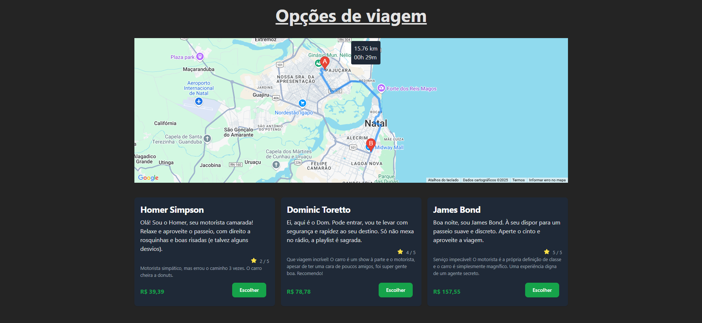
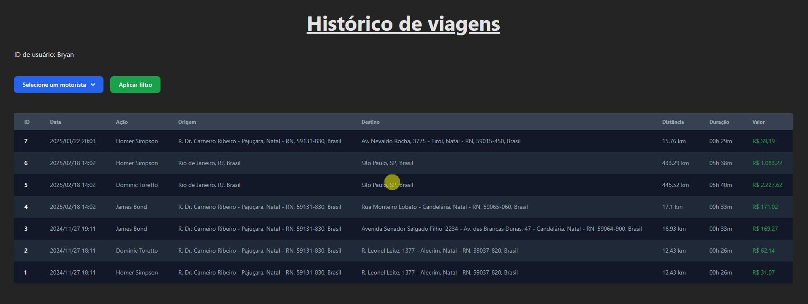

# 📍🗺️ Drive-Select

<div align="center">



<div data-badges>
    
    
    
    
    
    
    
</div>
</div>

A ideia é simples: um aplicativo web de viagens, semelhante ao Uber, onde usuários podem solicitar corridas.

## ⚙️ Como rodar?

### Pré-requisitos:

* Ter o docker e o docker-compose instalado e configurado
* Chave api do places da google

### Passos:


1. criar o .env

O projeto foi feito usando a api places da google, portanto é necessário que tenha uma chave api gerado no gcp com permissão para usar a api places. [pode ser gerada aqui](https://console.cloud.google.com/apis).

Com a chave, deve ser criado um arquivo .env na raiz da seguinte forma:

``` GOOGLE_API_KEY = [sua chave api] ```

2. buildar e rodar com o docker compose

Para iniciar o projeto basta excutar o comando:

``` docker-compose up ```

Após o processo ele deve estar disponível em [localhost:80](http://localhost:80)

## 🛠️ Features

✅ Interface web para solicitação de corridas com visualização da rota, distância e tempo de viagem aproximado

✅ Sistema básico de matching entre passageiros e motoristas

✅ Backend estruturado para gerenciamento de viagens

## 💻 Tecnologias

* Node
* React
* Places Api
* Docker





## Links Úteis

* [docker](https://www.docker.com/)
* [apis gcp](https://cloud.google.com/apis)
